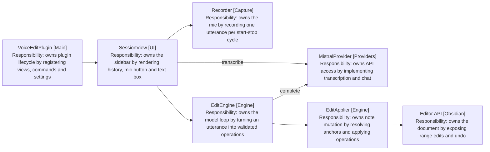
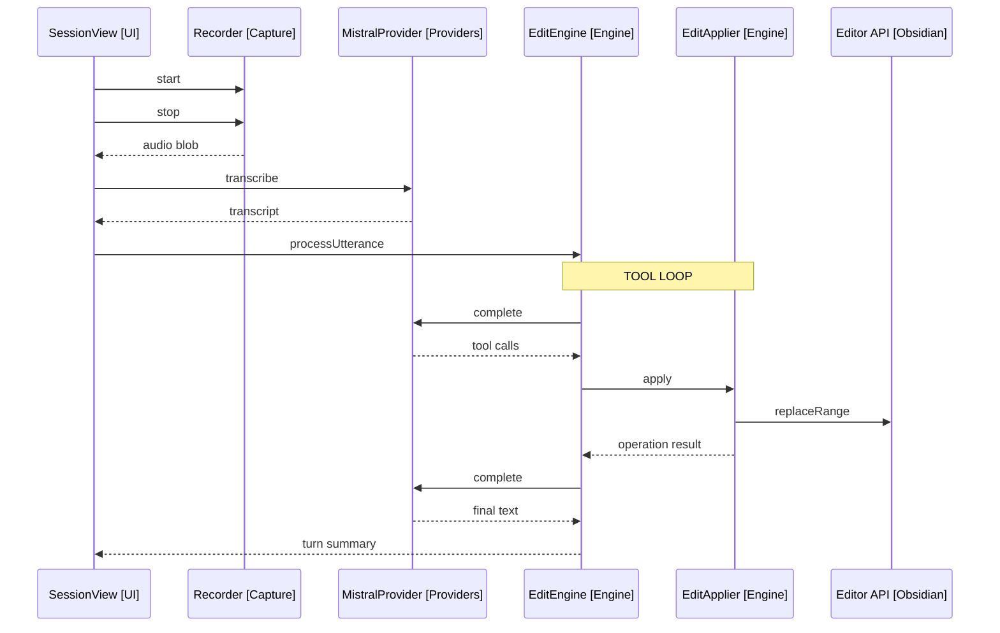

# Design: Desktop MVP

Covers release 1 of [2-plan.md](../2-plan.md): the full loop on desktop with record-then-transcribe capture. Modules referenced in brackets: UI, Capture, Providers, Engine, plus the external systems Obsidian and Mistral.

## Module Map

Arrows: uses-relationship (client to supplier).

## Provider Interface

- TranscriptionProvider [Providers]: transcribe(audio, language) returns text. MVP implementation posts the recorded blob to Mistral's batch endpoint.
- ChatProvider [Providers]: complete(messages, tools) returns tool calls or text.
- MistralProvider [Providers] implements both. The interfaces are the seam FR26 requires; no second implementation ships in this release.

## Utterance Flow

Arrows: uses-relationship (client to supplier).

The loop repeats while the model returns tool calls. A text-only response ends the turn; it is either a summary or a clarifying question, and SessionView renders it in the history either way.

## Edit Tools

| Tool         | Arguments                                      | Effect                                 |
| ------------ | ---------------------------------------------- | -------------------------------------- |
| replace_text | anchor_text, replacement                       | Replaces the unique anchor match       |
| insert_text  | anchor_text, position (before/after), content  | Inserts content adjacent to the anchor |
| insert_at    | location (note_start/note_end/cursor), content | Inserts at a fixed location            |

- The system prompt carries the full note content, the cursor position, and the dictation-formatting rules (FR15-21).
- One turn may contain several tool calls (FR14); they apply in order.

## Anchor Resolution

- An anchor must match the note text exactly and uniquely.
- Zero matches or multiple matches fail the operation; the failure is returned to the model as the tool result, and the model retries with a longer anchor or asks the user (FR13).
- Offsets are recomputed after each applied operation, since earlier operations shift positions.

## Conversation State

- EditSession [Engine] holds the bound file, the message history, and the applied-operation log.
- History is provider-format messages, so follow-ups reuse the same array (FR4).
- The note content is re-read and re-sent each turn; the note may have been edited by hand between utterances.

## Error Handling

- Each layer returns an Outcome; SessionView is the only place that renders errors, naming the failing step (NFR5).
- A failed transcription leaves the history untouched. A failed operation mid-turn stops the turn; already-applied operations stay, and the summary says what landed.
